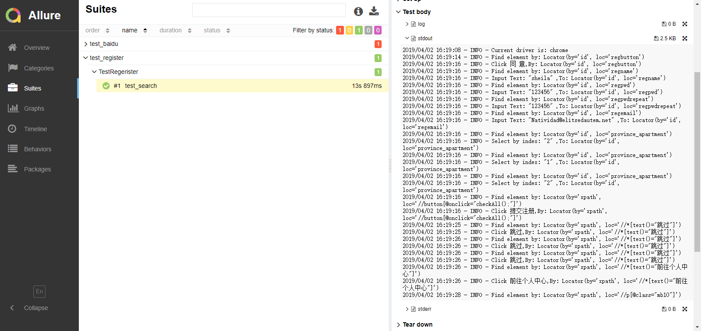

### 框架介绍
1. 根据PageObject对Selenium进行封装
1. 使用driver封装了chrome、firefox、edge浏览器
2. 使用yaml分离测试代码和数据
3. 使用logging库实现日志功能
4. 使用Allure Report作为测试报告

### PageObject模式
一个页面一个page，变量封装页面元素，方法封装页面行为，base_page封装常用方法
```
class BaiduPage(BasePage):
    input_search = (By.XPATH,'//*[@id="kw"]')
    btn_search = (By.XPATH,'//*[@id="su2"]')

    def search(self):
        self.send_keys(self.input_search,"nihao")
        self.click(self.btn_search)
```

### win10运行
```
cd testcase
pytest test_baidu.py --alluredir=../repor
```

### 在Jenkins上运行
1. 安装环境：python3, pip3, 库,
在Linux使用root上运行：
```
yum install -y epel-release
yum install -y python34
yum install -y python34-setuptools
easy_install-3.4 pip
pip3 install -r requirements.txt
```
2. 在jenkins上安装allure插件
3. 在全局工具管理安装Allure Commandline
4. 新建Project并配置
    4.1 Source Code Management： 填入github仓库地址以及对应的token
    4.2 Build： 新增执行Shell： 填入：
    ```
cd testcase
python3 -m pytest test_baidu.py --alluredir=../report/
exit 0
    ```
    4.3 Post-build Actions: Allure Report: Path中填入report
5. 构建

### 报告：
